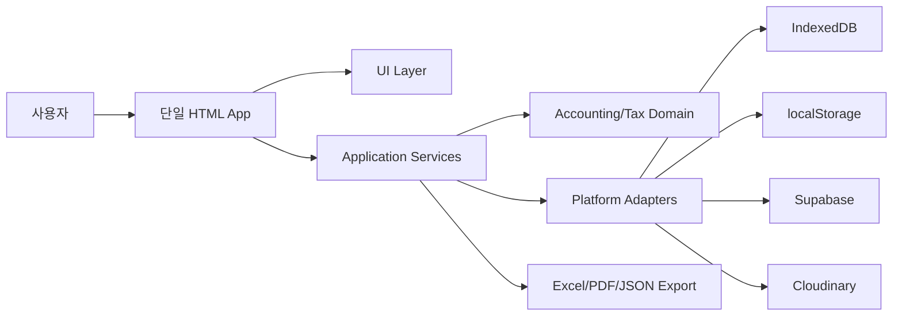
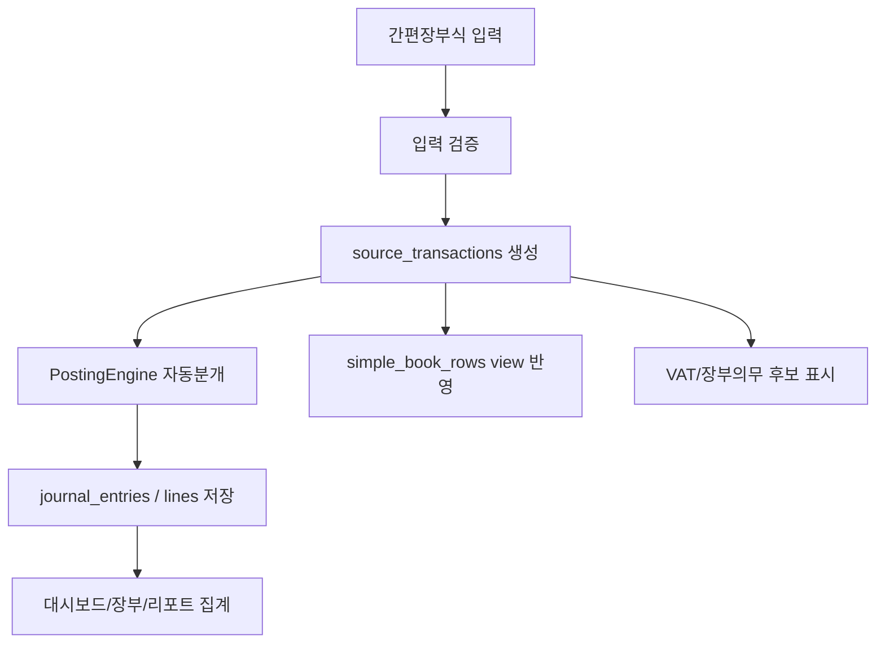
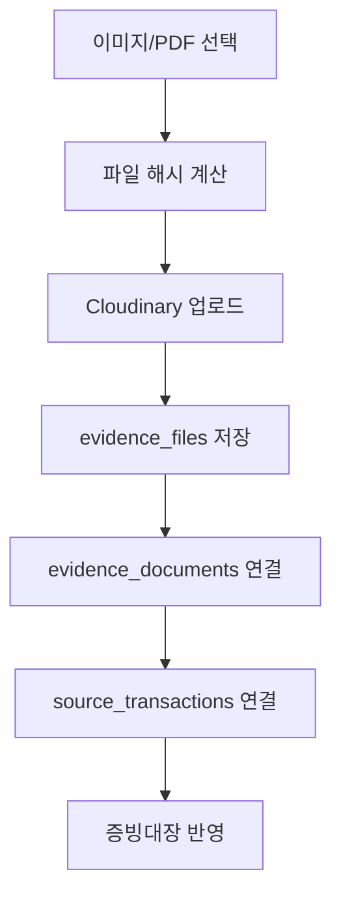
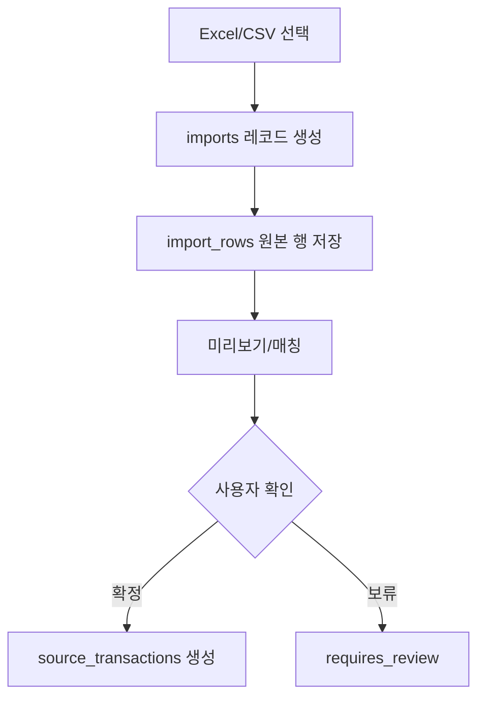
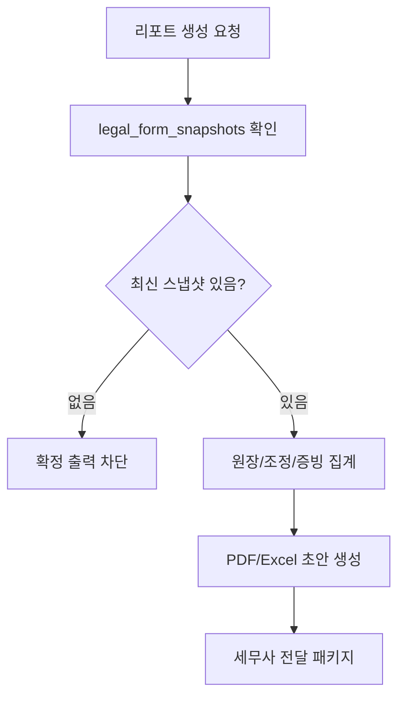
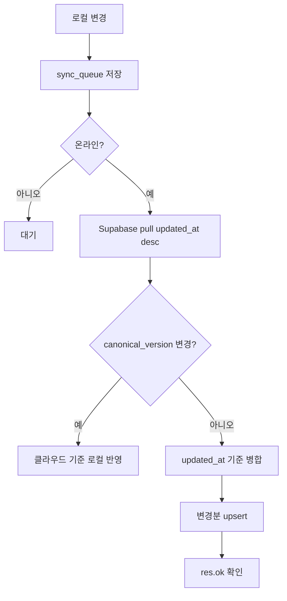

# Accounting Ledger V1 Detailed Design

> 작성일: 2026-07-09  
> 상태: V1 상세 설계 시작  
> 기준 문서: `accounting-ledger-design-directive-v2.md`, `accounting-v1-scope-skill.md`

## 1. V1 설계 목표

V1은 대한민국 개인사업자 1인이 사용할 수 있는 단일 HTML 회계장부 앱이다. 사용자는 간편장부처럼 쉽게 입력하지만, 앱 내부 원장은 복식부기 기반으로 유지한다.

핵심 목표:

| 목표 | 설계 방향 |
|---|---|
| 쉬운 입력 | 간편장부식 거래 입력 UX |
| 정확한 내부 구조 | 원천거래, 전표, 결제, 증빙, 자산, 세무판정을 분리 |
| 확장성 | 복수 사업장, 법인 전환, APK 전환을 구조상 허용 |
| 보안 | Google OAuth, 허용 이메일, Supabase RLS 유지 |
| 증빙 | Cloudinary에 이미지/PDF 원본 저장 |
| 신고 준비 | 세무사 전달 패키지와 법정 최신 신고서식 초안 생성 |
| 동기화 | `updated_at` 병합 + `canonical_version` 최종본 모드 |

V1에서 실제 전자신고 파일, 법인세 신고, 세무사 로그인 공유, 자동 은행/카드/PG 연동, AI 화면 기능은 만들지 않는다.

## 2. 시스템 구조

계층:

| 계층 | 역할 |
|---|---|
| UI Layer | 화면, 폼, 검토 상태, 사용자 확인 |
| Application Services | 저장, 동기화, 업로드, import/export, 리포트 흐름 조율 |
| Domain Modules | 회계 원장, 자동분개, VAT 후보, 장부의무 후보, 감가상각 후보 |
| Platform Adapters | IndexedDB, localStorage, Supabase, Cloudinary, 파일 다운로드 추상화 |
| External Services | Supabase Auth/Postgres, Cloudinary, 국가법령정보센터/국세청 확인값 |

브라우저 API와 외부 서비스 호출은 앱 전체에서 직접 흩뿌리지 않고 adapter를 통해 호출한다.

## 3. 주요 모듈

| 모듈 | 책임 |
|---|---|
| `AppShell` | 초기화, 라우팅, 전역 상태, 오류/경고 표시 |
| `AuthService` | Google OAuth, 허용 이메일 확인, 로그아웃, 로컬 캐시 삭제 |
| `BusinessService` | 사업자/사업장/과세기간/업종코드 설정 |
| `LedgerInputService` | 간편장부식 입력값을 원천거래 후보로 변환 |
| `PostingEngine` | 원천거래에서 복식 전표와 전표라인 생성 |
| `PaymentService` | 카드대금, 은행입출금, PG정산, 외상 회수/상환 처리 |
| `EvidenceService` | 증빙 문서 메타와 이미지/PDF 파일 수명주기 |
| `CloudinaryUploadAdapter` | 제한적 unsigned upload preset으로 원본 업로드 |
| `ImportExportService` | 국세청 간편장부 Excel import/export, 세무사 패키지 |
| `TaxClassificationService` | 사업자 유형, VAT, 장부의무 후보 판정 |
| `LegalFormService` | 법정서식 스냅샷 확인과 리포트 출력 가능 여부 판단 |
| `ReportService` | 간편장부, 신고 준비자료, 증빙대장, 검토목록 생성 |
| `SyncService` | 일반 병합, 최종본 지정, 업로드 대기열, 진단 |
| `BackupService` | JSON 백업/복원, 민감자료 보관 경고 |
| `ClosingService` | 월마감/연마감 상태, 잠금, 마감 후 수정 사유 |
| `AuditService` | 중요 변경의 before/after 기록 |
| `DecisionNoteService` | 거래 판단메모 저장과 세무사 전달 |
| `AppResearchNoteService` | 앱 개발/업데이트 이력 기록 |

## 4. V1 핵심 데이터 흐름

### 4.1 거래 입력 흐름

불변조건:

1. 간편장부 행을 SSOT로 저장하지 않는다.
2. 원천거래가 먼저이고 전표는 원천거래에서 생성된다.
3. 전표 생성 규칙에는 `posting_rule_version`을 남긴다.
4. 사용자가 거래를 수정하면 원천거래 `updated_at`을 갱신하고 전표 재생성 또는 조정 흐름을 탄다.

### 4.2 증빙 첨부 흐름

불변조건:

1. Cloudinary에는 원본 이미지/PDF를 저장한다.
2. DB에는 파일 메타와 `cloudinary_public_id`를 저장한다.
3. 업로드 실패 거래는 저장 가능하되 `upload_status='pending'` 또는 `failed`로 둔다.
4. AI/OCR은 V1 화면에 노출하지 않는다.

### 4.3 import 흐름

V1에서는 국세청 간편장부 Excel import/export를 구현한다. 은행, 카드, PG, 홈택스 import는 메뉴와 구조만 둔다.

### 4.4 리포트 흐름

법정 신고서식 리포트는 스냅샷 없이는 확정 출력하지 않는다.

### 4.5 동기화 흐름

최종본 지정과 일반 병합은 서로 다른 모드다.

## 5. 화면 구조

V1 첫 화면은 랜딩페이지가 아니라 업무 대시보드다.

| 화면 | 주요 기능 |
|---|---|
| 대시보드 | 입력 현황, 미첨부 증빙, 검토거래, 동기화/백업/마감 상태 |
| 거래 입력 | 수입, 비용, 자산, 결제/외상, 증빙 첨부 |
| 장부 | 간편장부 view, 복식 전표 고급 화면 |
| 증빙 | 이미지/PDF 파일 목록, 업로드 상태, 증빙대장 |
| 가져오기 | 국세청 간편장부 Excel import 미리보기 |
| 리포트 | 간편장부 Excel, 법정 신고서식, VAT 집계, 세무사 패키지 |
| 마감 | 월마감/연마감, 잠금, 수정 사유, 감사로그 |
| 설정 | 사업자/사업장, 업종코드, Google 허용 계정, Supabase/Cloudinary 설정 |
| 개발 기록 | 앱 연구노트, 버전, 스킬 문서 기준 |

## 6. 상태값 표준

| 대상 | 상태값 |
|---|---|
| 거래 | `draft`, `posted`, `requires_review`, `closed`, `voided` |
| 전표 | `generated`, `posted`, `reversed`, `adjusted` |
| 증빙 업로드 | `pending`, `uploaded`, `failed`, `deleted` |
| import 행 | `pending`, `matched`, `confirmed`, `skipped`, `failed`, `requires_review` |
| 리포트 | `draft`, `blocked_missing_form`, `ready`, `exported`, `requires_review` |
| 마감 | `open`, `soft_closed`, `closed`, `reopened` |
| 동기화 | `idle`, `pending`, `syncing`, `blocked`, `error`, `complete` |

## 7. V1 완료 기준

| 기준 | 완료 조건 |
|---|---|
| 로그인 | 허용된 Google 계정만 데이터 접근 |
| 입력 | 수입/비용/자산 거래 입력 가능 |
| 전표 | 자동분개 생성, 차대변 검증 |
| 장부 | 간편장부 view와 Excel export |
| 증빙 | 이미지/PDF Cloudinary 업로드와 증빙대장 |
| 백업 | JSON 백업/복원 왕복 |
| 동기화 | 일반 병합과 최종본 지정 동작 |
| 세무 | VAT 집계, 종합소득세 준비자료 초안 |
| 리포트 | 최신 법정서식 스냅샷 연결 없이는 확정 출력 차단 |
| 세무사 전달 | 4종 패키지 생성 |
| 마감 | 월/연마감 잠금과 감사로그 |

## 8. 구현 순서

1. 단일 HTML 앱 셸과 adapter 뼈대
2. IndexedDB/localStorage 저장 래퍼
3. Supabase Auth/RLS/스키마 준비
4. 사업자/사업장/계정과목/거래 입력
5. PostingEngine과 간편장부 view
6. Cloudinary 증빙 첨부
7. JSON 백업/복원
8. 동기화와 canonical_version
9. 국세청 간편장부 Excel import/export
10. VAT/소득세 준비자료와 법정서식 스냅샷
11. 세무사 전달 패키지
12. 마감/감사로그/대시보드 정리

## 9. 개발 품질 게이트

모든 기능 변경은 `docs/skills/accounting-development-governance-skill.md`의 역할 체계와 릴리스 게이트를 적용한다. 특히 다음 변경은 구현 전에 계약·보안·마이그레이션 검토를 완료한다.

| 변경 | 추가 필수 게이트 |
|---|---|
| Supabase 스키마, RLS, Auth | Schema/Contract Guardian, Security Reviewer, Migration Agent |
| IndexedDB, sync queue, canonical sync, JSON 백업 | Schema/Contract Guardian, Security Reviewer, Migration Agent |
| 자동분개, VAT, 장부의무, 리포트 | Schema/Contract Guardian, UI/UX Reviewer |
| Cloudinary 증빙 | Security Reviewer, Schema/Contract Guardian, UI/UX Reviewer |
| GitHub Pages 배포 | Test Engineer, Reviewer, Release Manager |

앱 버전은 `0.00`에서 시작하며, 사용자에게 제공하는 확정 변경은 `0.01`씩 증가한다. 변경된 스킬 문서는 개별 `Sub_` 버전을 함께 증가시키고, 연구노트에 실제 적용 역할과 검증 결과를 기록한다.

## 10. 참조 문서

| 문서 | 역할 |
|---|---|
| `docs/accounting-ledger-design-directive-v2.md` | 최상위 설계 지침 |
| `docs/skills/accounting-v1-scope-skill.md` | 1차 범위 고정 |
| `docs/skills/accounting-auth-login-skill.md` | Google 로그인/RLS |
| `docs/skills/accounting-evidence-archive-skill.md` | 증빙 보관 |
| `docs/skills/accounting-legal-forms-skill.md` | 법정 최신 서식 |
| `docs/skills/accounting-mobile-apk-readiness-skill.md` | 모바일/APK 대비 |
| `docs/skills/accounting-development-governance-skill.md` | 개발 운영, 품질 게이트, 릴리스 관리 |
| `docs/skills/accounting-claude-collaboration-skill.md` | Claude 또는 다른 AI와의 인수인계 기준 |
| `docs/skills/accounting-harness-quality-gate-skill.md` | 실행 가능한 품질 게이트와 CI 기준 |
