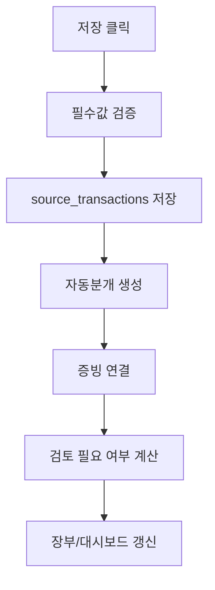

# Accounting Ledger V1 Screen Flow

> 작성일: 2026-07-09  
> 상태: V1 화면/흐름 상세 설계  
> 원칙: 첫 화면은 랜딩페이지가 아니라 실제 업무 대시보드다.

## 1. 내비게이션 구조

V1은 단일 HTML 앱 내부에서 탭/라우트 방식으로 화면을 전환한다.

| 메뉴 | 화면 |
|---|---|
| 대시보드 | `/dashboard` |
| 거래 입력 | `/transactions/new` |
| 장부 | `/ledger` |
| 전표 검토 | `/journals` |
| 증빙 | `/evidence` |
| 가져오기 | `/imports` |
| 리포트 | `/reports` |
| 마감 | `/closing` |
| 설정 | `/settings` |
| 개발 기록 | `/app-notes` |

모바일/APK를 대비해 URL hash 또는 내부 route state를 쓰되, 화면 상태와 도메인 로직은 분리한다.

## 2. 대시보드

대시보드는 앱의 첫 화면이다.

### 2.1 대시보드 카드

| 카드 | 표시 내용 | 클릭 시 |
|---|---|---|
| 이번 달 입력 | 수입, 비용, 자산거래 건수와 합계 | 장부 필터 |
| 미첨부 증빙 | 증빙이 없는 거래 수 | 증빙 필요 목록 |
| 검토 필요 | VAT, 계정과목, import, 마감 후 수정 후보 | 검토 목록 |
| 동기화 | 마지막 동기화, 대기열, 오류 | 동기화 진단 |
| 백업 | 마지막 백업, 백업 필요 경고 | 백업/복원 |
| 마감/신고 | 월마감, 연마감, 신고 준비 체크리스트 | 마감 화면 |

### 2.2 대시보드 불변조건

1. 첫 화면에 마케팅 문구를 두지 않는다.
2. 사용자가 지금 처리해야 할 항목을 먼저 보여준다.
3. 동기화 오류, 백업 오래됨, 미첨부 증빙은 숨기지 않는다.
4. 숫자 요약은 내부 원장 기준으로 계산한다.

## 3. 거래 입력 화면

### 3.1 입력 모드

| 모드 | 기본 필드 |
|---|---|
| 수입 | 거래일, 거래처, 계정과목, 거래내용, 공급가액/부가세/합계, 결제상태, 증빙 |
| 비용 | 거래일, 거래처, 계정과목, 거래내용, 공급가액/부가세/합계, 지급상태, 증빙 |
| 자산구입 | 거래일, 자산명, 거래처, 취득금액, 부가세, 결제상태, 내용연수 후보, 증빙 |
| 자산매각 | 거래일, 자산, 매각금액, 부가세, 증빙 |
| 결제/수금 | 지급일/수금일, 금액, 결제수단, 연결 거래 |

간단 모드에서는 거래일, 유형, 거래처, 내용, 금액, 증빙만 먼저 보인다. VAT, 외상, 자산, 감가상각, 과세구분은 필요 시 펼쳐진다.

### 3.2 입력 후 처리

### 3.3 검토 필요 조건

| 조건 | 표시 |
|---|---|
| VAT 공제 여부 불명확 | VAT 검토 필요 |
| 계정과목 자동 후보 신뢰 낮음 | 계정과목 확인 필요 |
| 증빙 없음 | 증빙 첨부 필요 |
| 한 행에 수입/비용/자산 금액이 함께 있음 | import 행 검토 필요 |
| 마감 기간 거래 수정 | 마감 후 수정 사유 필요 |

## 4. 장부 화면

### 4.1 간편장부 view

열은 국세청 간편장부 Excel 구조와 맞춘다.

| 열 | 의미 |
|---|---|
| 일자 | 월/일 또는 거래일 |
| 계정과목 | 표준 계정과목 |
| 거래내용 | 설명 |
| 거래처 | 거래처 |
| 수입 금액/부가세 | 수입 후보 |
| 비용 금액/부가세 | 비용 후보 |
| 사업용 자산 금액/부가세 | 자산 취득/매각 |
| 비고 | 증빙/결제/검토 메모 |

### 4.2 고급 전표 화면

전표 화면은 숨기지 않고 고급/검토용으로 제공한다.

| 영역 | 표시 |
|---|---|
| 전표 헤더 | 전표일, 원천거래, 상태, 생성 규칙 버전 |
| 전표 라인 | 계정과목, 차변, 대변, 메모 |
| 검증 | 차대변 일치, 미확정 계정, 마감 상태 |
| 액션 | 원천거래 보기, 재생성 후보, 조정 메모 |

## 5. 증빙 화면

### 5.1 증빙 목록

| 열 | 의미 |
|---|---|
| 날짜 | 증빙 일자 |
| 거래처 | 발행자/거래처 |
| 유형 | 세금계산서, 계산서, 카드, 현금영수증, 영수증, 계약서 |
| 파일 | 이미지/PDF |
| 연결 거래 | 원천거래 링크 |
| 업로드 상태 | pending/uploaded/failed/deleted |
| 검토 상태 | pending/confirmed/requires_review |

### 5.2 첨부 흐름

1. 거래 상세 또는 증빙 화면에서 파일을 선택한다.
2. 이미지/PDF만 V1 보관 대상으로 받는다.
3. Cloudinary 업로드 후 `evidence_files`에 메타를 저장한다.
4. 거래와 연결되지 않은 증빙은 미연결 증빙으로 표시한다.
5. AI 요약 버튼은 V1 화면에 두지 않는다.

## 6. 가져오기 화면

V1은 국세청 간편장부 Excel import/export를 우선한다.

### 6.1 Import 단계

| 단계 | 화면 |
|---|---|
| 파일 선택 | 국세청 간편장부 Excel 선택 |
| 구조 확인 | `장부`, `통계` 시트와 열 구조 확인 |
| 미리보기 | 행별 수입/비용/자산 후보 표시 |
| 검토 | 오류/중복/불명확 행 표시 |
| 확정 | 선택한 행만 원천거래 생성 |

은행/카드/PG/홈택스 import는 메뉴는 보이되 V1에서는 준비중 상태로 둔다.

## 7. 리포트 화면

### 7.1 리포트 종류

| 리포트 | V1 상태 |
|---|---|
| 국세청 간편장부 호환 Excel | 출력 |
| 간편장부소득금액계산서 | 법정서식 스냅샷 연결 초안 |
| 총수입금액 및 필요경비명세서 | 법정서식 스냅샷 연결 초안 |
| 감가상각비 조정명세서 | 자산대장 기반 초안 |
| VAT 집계표 | 검토용 |
| 세무사 전달 패키지 | 생성 |

### 7.2 리포트 생성 전 검사

| 검사 | 실패 시 |
|---|---|
| 법정서식 스냅샷 있음 | 확정 출력 차단 |
| 마감 상태 | 경고 표시 |
| 미첨부 증빙 | 검토 목록 포함 |
| VAT 검토 필요 | 검토 목록 포함 |
| import 미확정 행 | 검토 목록 포함 |
| 자산 감가상각 미확정 | 검토 목록 포함 |

## 8. 마감 화면

| 기능 | V1 처리 |
|---|---|
| 월마감 | 기간 상태 잠금 |
| 연마감 | 연도 상태 잠금 |
| 마감 후 수정 | 경고, 사유 입력, 감사로그 |
| 재오픈 | owner만 가능 |
| 자동 수정분개 | V1 제외 |

마감 상태는 거래 수정 가능 여부와 리포트 경고에 영향을 준다.

## 9. 설정 화면

| 설정 | V1 처리 |
|---|---|
| 사업자 정보 | 개인사업자 1개 사업장 중심 |
| 사업장 | 복수 구조는 보관, UI는 1개 중심 |
| 업종코드 | 수동 입력/등록/갱신 |
| Google 허용 이메일 | owner만 추가/해제 |
| Supabase | URL, publishable key |
| Cloudinary | cloud name, upload preset |
| 백업/복원 | JSON 백업/복원 |
| 로컬 캐시 | 캐시 삭제 |

## 10. 개발 기록 화면

연구노트는 앱 개발/업데이트 이력이다.

| 항목 | 표시 |
|---|---|
| 앱 버전 | `APP_INFO.version` |
| 스킬 버전 | 관련 스킬 문서 버전 |
| 업데이트 이력 | 앱 변경 요약 |
| 설계 결정 | 주요 결정과 이유 |
| 오류 교훈 | 재발 방지 기록 |

거래 판단 근거는 개발 기록 화면이 아니라 거래/리포트의 판단메모에서 다룬다.

## 11. 모바일 반응형 기준

| 화면 | 모바일 기준 |
|---|---|
| 대시보드 | 카드 1열, 중요한 경고 우선 |
| 거래 입력 | 한 화면 한 작업, 숫자 입력 안정성 우선 |
| 장부 | 가로 스크롤 허용, 필터 우선 |
| 증빙 | 파일/사진 선택 확장 가능 구조 |
| 리포트 | 모바일에서는 생성/상태 확인 중심, 큰 표는 다운로드 |

APK 전환 시에도 동일 화면을 재사용하되 파일 선택, 공유, 로컬 잠금은 adapter로 교체한다.
