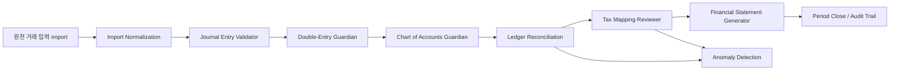

> **Sub_domain-guardians_0.01** · 개정 2026-07-11

# Accounting Ledger Domain Guardians Skill

이 문서는 대한민국 개인사업자용 간편장부·복식부기 통합 회계 프로그램에서 회계 데이터의 정확성, 세무 매핑, 감사 추적, 마감 안정성을 검토하는 도메인 에이전트 체계다. 개발 에이전트가 코드 품질을 본다면, 이 문서의 에이전트들은 장부 자체가 회계적으로 성립하는지 검증한다.

## 핵심 원칙

1. 사용자 입력 화면은 간편해야 하지만 내부 원장은 복식부기 SSOT를 유지한다.
2. 모든 원천 거래는 분개, 원장, 리포트, 세무 매핑으로 추적 가능해야 한다.
3. 법령·서식·세무 판단은 현재 확인된 근거와 버전을 남긴다.
4. 검증 실패는 조용히 보정하지 않고 사용자에게 원인과 수정 후보를 표시한다.
5. 신고·세무사 전달용 출력은 법정 최신양식 확인 전에는 확정 출력으로 표시하지 않는다.

## 도메인 에이전트

| 에이전트 | 우선순위 | 책임 | 최소 산출물 |
|---|---|---|---|
| Double-Entry Guardian | 필수 | 모든 거래의 차변 합계와 대변 합계가 일치하는지 검증 | 불균형 분개 목록, 차액, 원천 거래 ID |
| Journal Entry Validator | 필수 | 분개 날짜, 금액, 계정과목, 거래처, 증빙, 과세구분의 입력 유효성 검증 | 입력 오류, 누락 필드, 자동분개 근거 |
| Chart of Accounts Guardian | 필수 | 국세청 용어와 내부 계정과목 체계를 일관되게 유지 | 계정과목 매핑표, 비활성/중복/미분류 계정 |
| Ledger Reconciliation Agent | 필수 | 총계정원장, 현금, 통장, 카드, 미수/미지급 잔액 대사 | 대사 차이, 미매칭 거래, 조정 후보 |
| Period Close Guardian | 매우 권장 | 월·분기·연도 마감, 마감취소, 마감 후 수정 이력 관리 | 마감 상태, 잠금 범위, 재개방 사유 |
| Audit Trail Guardian | 필수 | 생성·수정·삭제·동기화·마감·권한 변경 이력 보존 | 변경 전후 값, actor, timestamp, source |
| Import Normalization Agent | 필수 | Excel, CSV, 카드, 통장, 국세청 양식을 표준 거래 구조로 정규화 | import batch, 필드 매핑, 실패 행, 중복 후보 |
| Financial Statement Generator | 매우 권장 | 손익계산서, 재무상태표, 원장, 간편장부, 세무사 전달 패키지 생성 | 리포트 ID, 기준기간, form snapshot, 검증 상태 |
| Tax Mapping Reviewer | 필수 | 부가세, 종합소득세, 필요경비, 불공제, 업종별 세무 매핑 검토 | 세무 매핑 근거, 예외 항목, 검토 필요 표시 |
| Anomaly Detection Agent | 권장 | 중복, 이상금액, 증빙 누락, 계정과목 오분류, 기간 오류 탐지 | anomaly score, 규칙 ID, 사용자 확인 상태 |

## 법령 체계도 연결

도메인 에이전트는 법령 체계도와 다음 순서로 연결한다.

| 판단 단계 | 연결 에이전트 | 법령·서식 연결점 |
|---|---|---|
| 사업자 유형·과세유형 판단 | Tax Mapping Reviewer | 소득세법, 부가가치세법, 업종코드, 간편장부/복식부기 의무 기준 |
| 계정과목 선택 | Chart of Accounts Guardian | 국세청 계정과목·신고서 항목·필요경비 분류 |
| 거래 입력·자동분개 | Journal Entry Validator, Double-Entry Guardian | 장부 기장 원칙, 증빙 보관, 과세/면세/불공제 구분 |
| 원장·잔액 검증 | Ledger Reconciliation Agent | 총수입금액, 필요경비, 자산·부채 잔액 근거 |
| 부가세·종소세 매핑 | Tax Mapping Reviewer | 신고서 항목, 세액계산 구조, 업종별 예외 |
| 법정 리포트 출력 | Financial Statement Generator | 최신 법정서식 snapshot, 신고서·명세서 별지 |
| 마감·수정·감사 | Period Close Guardian, Audit Trail Guardian | 신고기한, 수정신고·경정청구, 보관·감사 추적 |

## 검증 흐름



## 구현 규칙

1. 모든 검증 결과는 `pass`, `warning`, `error`, `manual_review` 중 하나로 기록한다.
2. `error`는 확정 저장, 마감, 신고용 출력 단계에서 차단 조건으로 사용할 수 있다.
3. `warning`은 저장은 허용하되 대시보드와 리포트 생성 전 검토 목록에 표시한다.
4. `manual_review`는 세무 판단 또는 법령 근거가 불충분한 항목에 사용한다.
5. 자동 보정은 사용자가 승인한 경우에만 원천 거래 또는 분개를 변경한다.
6. 법령·서식 기반 검증은 `legal_form_snapshots`, `legal_reference_checks`, `tax_rule_version`과 연결한다.
7. import 검증은 원본 행 번호, 원본 파일 해시, 변환 전후 값을 보존한다.
8. 동기화 대상 검증 레코드는 `id`, `created_at`, `updated_at`, `deleted_at`과 canonical sync 규칙을 따른다.

## 데이터 모델 권장

```sql
accounting_validation_runs (
  id uuid primary key,
  business_id uuid not null,
  tax_year int not null,
  period_start date,
  period_end date,
  validation_scope text not null,
  status text not null,
  agent_versions jsonb not null,
  legal_snapshot_ids uuid[],
  started_at timestamptz default now(),
  completed_at timestamptz,
  created_at timestamptz default now(),
  updated_at timestamptz default now(),
  deleted_at timestamptz
);

accounting_validation_findings (
  id uuid primary key,
  run_id uuid not null,
  business_id uuid not null,
  agent_name text not null,
  severity text not null,
  finding_code text not null,
  source_table text,
  source_id uuid,
  message text not null,
  suggested_action text,
  user_resolution text,
  resolved_at timestamptz,
  created_at timestamptz default now(),
  updated_at timestamptz default now(),
  deleted_at timestamptz
);
```

## 릴리스 게이트

| 변경 유형 | 반드시 적용할 도메인 에이전트 |
|---|---|
| 거래 입력·자동분개 | Double-Entry, Journal Entry, Chart of Accounts, Audit Trail |
| Excel/CSV/import | Import Normalization, Journal Entry, Double-Entry, Anomaly Detection |
| 계정과목·업종코드 | Chart of Accounts, Tax Mapping, Legal Forms |
| 부가세·종소세 | Tax Mapping, Financial Statement, Legal Forms |
| 리포트·세무사 패키지 | Financial Statement, Tax Mapping, Audit Trail, Legal Forms |
| 마감·수정취소 | Period Close, Audit Trail, Ledger Reconciliation |
| Supabase/IndexedDB 동기화 | Audit Trail, Schema/Contract, Migration, Security |

## 금지 사항

- 차변·대변 불균형 거래를 정상 저장된 거래처럼 표시하지 않는다.
- 국세청 용어와 내부 계정과목을 근거 없이 분리하지 않는다.
- 법정 최신양식 확인 없이 신고용 확정 출력으로 표시하지 않는다.
- import 실패 행을 조용히 버리지 않는다.
- 마감 후 수정 이력을 삭제하거나 덮어쓰지 않는다.
- 이상탐지를 AI 추론처럼 표시하지 않는다. V1은 규칙 기반 검증으로 시작한다.
